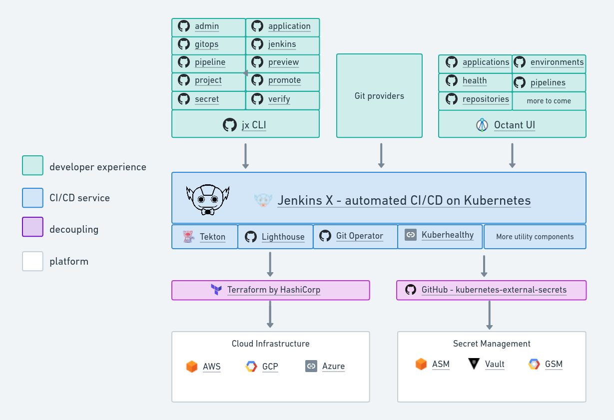

# Election Web App (E.S.A)

This project is for the Politics Department at the University of Surrey. The primary objective is to provide an Electoral Simulation Voting Application that demonstrates to students election systems from around the world. This is done in an interactive manner that promotes student engagement and facilitates the understanding of various voting systems.

## Table of Contents

- [Election Web App (E.S.A)](#election-web-app-esa)
  - [Table of Contents](#table-of-contents)
  - [Project Overview](#project-overview)
    - [Election Algorithms](#election-algorithms)
  - [Features](#features)
  - [Technologies](#technologies)
  - [User Types](#user-types)
  - [Jenkins X CI/CD](#jenkins-x-cicd)
  - [Jenkins X CI/CD](#jenkins-x-cicd-1)
    - [Repositories](#repositories)
  - [Database](#database)
    - [Entities](#entities)
    - [Relationships](#relationships)
  - [License](#license)

## Project Overview

The application presents an Electoral Voting System that performs two major functions:

1. Compute votes and convert them into seats/points using various voting algorithms.
2. Serve as a Simulation Game where students represent various nations and discuss their political concerns.

The application was chosen over other proposed systems due to its interactive nature, promoting student engagement. It combines the use of voting systems in the Electoral System project and adds an interactive feature of the Simulation game project.

The application is intended to be a more interactive and engaging version of traditional election calculators, such as Yavuz Oruc's D'Hondt election calculator. Instead of a simple vote tally, the application examines student replies to questions and performs electoral calculations based on their responses.

### Election Algorithms

The application supports majoritarian, proportional, and mixed voting systems. The following election algorithms were implemented:

- **Proportional System**: The D’Hondt Algorithm
- **Majoritarian System**: The Modified Borda Count Algorithm
- **Mixed System**: The D'Hondt and Modified Borda Count

These algorithms were implemented using a question results table. The voter's responses are recorded in the question results database after the submit button is clicked.

## Features

The application contains features similar to existing e-voting applications, such as eBallot and Election Buddy. These include:

- Usage of a single ballot with several questions that allow voters to submit questions within a specified timeframe.
- Self-administered ballots that enable students to engage with the ballot and provide a novel and entertaining opportunity to demonstrate their own beliefs on lecturer-represented topics.

Furthermore, the application has been designed to meet stringent standards for security, accuracy, integrity, speed, privacy, auditability, accessibility, scalability, and ecological sustainability. However, some of these criteria may not be precisely implemented as the application serves as a simulation tool rather than a real-world voting system.

## Technologies
The porject uses the following technologies:

- **Jenkins X**: Automates CI/CD and the process of creating, testing, and deploying applications to Kubernetes.
- **Terraform**: Manages the infrastructure needed to run Jenkins X and other cloud resources.
- **Kubernetes**: Used as the container orchestration platform where the application is deployed.
- **Helm**: Utilized for managing Kubernetes applications; helps in defining, installing, and upgrading complex Kubernetes applications.
- **Ruby on Rails**: The main framework used for developing the web application.
- **Amazon EKS**: The managed service where the Kubernetes cluster is running.
- **Vault**: Secures, stores, and tightly controls access to tokens, passwords, certificates, and other secrets.

## User Types

The application accommodates three types of users with distinct tasks and responsibilities:

1. **Host**: The Host user has the ability to use CRUD modules for the Host, Ballot, Questions, and Options. The Host can see all pertinent information about their ballot, including the Start/End date, Ballot Pin, and Questions currently included in the ballot. The Host can manage the CRUD operations on their Questions and Options.
2. **Voters**: Voters can participate in a ballot using the Ballot Pin provided by the host. After the Ballot start time has elapsed, the questions page becomes available to Voters. If the Host has granted permission, the results of a ballot would be presented to the voter after the ballot's end date has passed.
3. **Admin**: The Admin user manages the Host and Voter users inside the application. However, this feature was not implemented due to time constraints.

## Jenkins X CI/CD

This server utilizes Jenkins X for Continuous Integration (CI) and Continuous Deployment (CD). Jenkins X manages the lifecycle of both infrastructure and cluster resources using GitOps, which helps to keep resources in sync.

## Jenkins X CI/CD

This server utilizes Jenkins X for Continuous Integration (CI) and Continuous Deployment (CD). Jenkins X manages the lifecycle of both infrastructure and cluster resources using GitOps, which helps to keep resources in sync.

### Repositories

There are two key repositories used for the Jenkins X infrastructure:

1. [jx-infrastructure](https://github.com/Klyde-Moradeyo/jx-infrastructure): This repository uses Terraform to manage the infrastructure needed to run Jenkins X. The cloud resources managed include a Kubernetes cluster, storage buckets for long-term storage of logs, and IAM bindings to manage permissions for applications using cloud resources.

2. [jx-cluster](https://github.com/Klyde-Moradeyo/jx-cluster): This repository installs Jenkins X with Vault. It contains the `helmfile.yaml` file which defines the Helm charts to deploy in the cluster. The infrastructure tends to change rarely, while the cluster git repository changes frequently (e.g., every time you add a new quickstart, import a project, release a project, etc.).

## Database

The application uses a database to persistently store a variety of information. Here is an overview of the database model:

### Entities

The database is composed of several entities with precisely defined attributes. These entities include:

- **User**: This entity represents each user in the application. It applies to the Voter, Host, and Admin users. The attributes defined for this entity are "First Name," "Last Name," and "Email."

- **Ballot**: This entity stores details of the ballot such as the title, start time, and the expiration time. The ballot is generated by a Host user.

- **Question**: This entity represents the question(s) created by the Host and answered by the Voter’s in the Host’s ballot.

- **Option**: This entity represents the various answer options available for each question.

- **Question Results**: This entity stores the results of each question answered by the voters.

- **Ballot Results**: This entity stores the complete results from a given ballot.

### Relationships

The relationships between the entities have been carefully designed:

- The "Ballot" entity has a reference to the "User" entity, representing the user who generated the ballot. This is achieved through a foreign key referencing the user and defining a primary key for the ballot.

- A given User may have several ballots, indicating a one-to-many relationship from User to Ballot.

- A ballot may have multiple voters, but each voter has only one ballot, indicating a one-to-many relationship from Ballot to User in the context of voting.

## License

This project is licensed under the MIT License.
